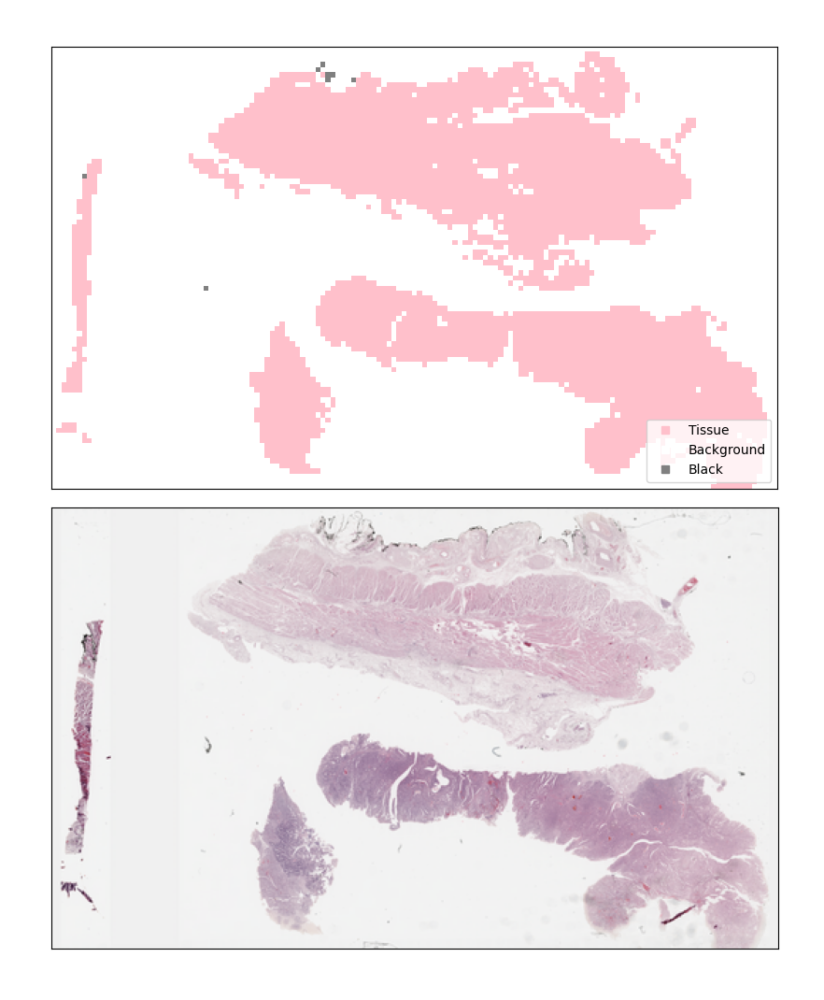
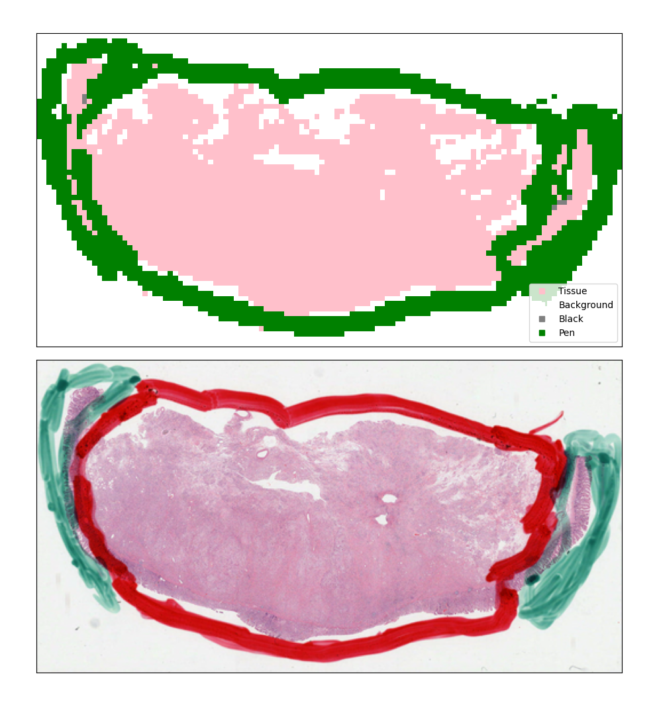

# Whole Slide Images Preprocessing for Deep Learning

This repository is dedicated to the preprocessing of Whole Slide Images (WSIs) for deep learning applications. It offers a seamless and highly configurable Python-based pipeline for downloading WSIs from The Cancer Genome Atlas (TCGA), extracting relevant patches/tiles, filtering out background and artifacts, and generating thumbnails for quick validation. Designed for efficiency and flexibility, it supports end-to-end preprocessing, ensuring the images are ready for deep learning workflows.

## Features

- **Highly Configurable**: Customize your preprocessing with options for tile size, fields of view, various filters (background, pen, and black spots), and logging levels.
- **Efficient Tiling and Filtering**: Leverages downsampled thumbnails for computations, deploying the process to the entire slide for final patch extraction. This not only speeds up the process but also allows for fast validation through thumbnail heatmaps.
- **Multiprocessing Capabilities**: Implements three levels of multiprocessing for maximized efficiency:
  1. Multiple workers for slide extraction.
  2. Parallel processing of slides through subprocesses.
  3. Independent downloading processes for simultaneous downloading and processing, optimizing time especially for large datasets.
- **Optimized Storage**: Offers an option to process and delete slides in batches, significantly reducing disk space requirements by only saving the necessary filtered patches.
- **Thumbnail Generation for Validation**: Enables the generation of a thumbnail heatmap with all filters applied, providing a fast and easy method to validate the tiling process. This feature is crucial for debugging and ensures that the extraction process meets the expected requirements before executing it over all slides. 

Examples: <br>
<center>



</center>


## Command-Line Options

The pipeline provides a range of command-line options to customize its operation according to your specific needs:

- `--config_filepath <path>`: Specifies the path to the configuration file. This parameter is required.
- `--preprocess`: Initiates the preprocessing pipeline with tiling.
- `--full-preprocess`: Activates a complete preprocessing flow, including slide downloading (requires `--manifest_path`).
- `--delete-after-tiling`: Deletes the slide files after tiling to save disk space.
- `--slide_uuids <UUIDs>`: Specifies the UUIDs of slides to be processed. Accepts multiple UUIDs.
- `--thumbnails-only`: Generates thumbnails without extracting full-resolution tiles.
- `--bring-thumbnails <path>`: Fetches and displays thumbnails for validation.
- `--bring-slide-logs <path>`: Gathers logs from slide processing for review.
- `--num-tiling-subprocesses <number>`: Sets the number of subprocesses for tiling.
- `--num-full-processes <number>`: Determines the number of processes for full preprocessing.
- `--manifest_path <path>`: Path to the TCGA manifest file for slide downloading.
- `--num-slides-per-full-process <number>`: Limits the number of slides processed per full process.

Each of these options offers a way to tailor the preprocessing steps, ensuring flexibility and efficiency tailored to the needs of researchers and practitioners in the field of deep learning and medical imaging.

## Getting Started

These instructions will get you a copy of the project up and running on your local machine for development and testing purposes.

### Prerequisites

Before you begin, ensure you have [Conda](https://docs.conda.io/en/latest/) installed on your system to manage your environments and packages.

### Clone the repository

First, clone the repository to your local machine:

```bash
git clone https://github.com/SharonPeled/whole-slide-images-preprocessing-for-deep-learning.git
```
Navigate into the cloned repository directory:

```bash
cd whole-slide-images-preprocessing-for-deep-learning
```

### Set up the Conda environment
Create and activate a new Conda environment using the env.yaml file provided in the repository:

```bash
conda env create -f env.yaml
conda activate WSI_pp
```

Note: If the installation of pyvips fails during the environment setup, try installing it independently:

```bash
pip install pyvips
```

or 

```bash
conda install -c conda-forge pyvips
```

### Setting up the environment for gdc-client
To download slides through an API from TCGA using gdc-client, set up a separate Conda environment:

```bash
conda create -n gdc -c bioconda -c conda-forge gdc-client
conda activate gdc
```

With the gdc environment activated, you can now use the gdc-client to download slides either by specifying slide UUIDs or by using a manifest file:

```bash
gdc-client download <slide uuids>
```

or 

```bash
gdc-client download -m <manifest file>
```

## License

This project is licensed under the MIT License - see the LICENSE file for details.
